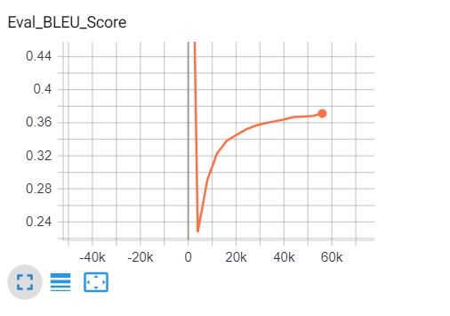
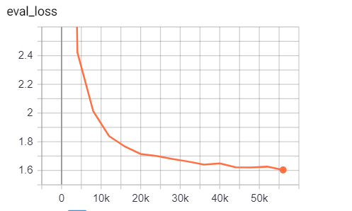
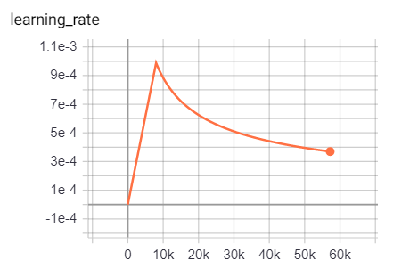

# Homework 9

## File
[nohup.out](https://github.com/erikhou45/w251-assignments/blob/master/hw9/nohup.out)

## Screenshots

## Questions

* How long does it take to complete the training run? (hint: this session is on distributed training, so it will take a while)
> It took 22 hours and 12 minutes to train for 50,000 steps.

* Do you think your model is fully trained? How can you tell?
> I think there is still room for the model to train more and get better performance because from the eval BLEU score is still increasing constantly and eval loss is still decreasing.

* Were you overfitting?
> Since the model doesn't have the eval BLEU score peaked and then declined or the eval loss started rising after reaching a minimum, I don't think we have overfitting issue with the model. 

* Were your GPUs fully utilized?
> Yes. When running nvidia-smi command, though there is some fluctuation in the GPU usage, it's mostly pretty high (in the 9x%) and it goes to 100% pretty often.

* Did you monitor network traffic (hint: apt install nmon ) ? Was network the bottleneck?
> Yes. The network doesn't seem to be the bottleneck. Since the GPUs were mostly fully utilized most of the time, there is no sign that the GPUs are waiting for network to transfer gradients between nodes in order to do the updates.

* Take a look at the plot of the learning rate and then check the config file. Can you explan this setting?
> The config file specifices 8000 warm-up steps. Therefore, in the learning rate graph, we can see the learning rate gradually increase from 0 to 8000 steps. Then the schedule mechanism kicks in and reduces the learning rate over time as the model trains more and approaches convergence.

* How big was your training set (mb)? How many training lines did it contain?
> Sinec we are training a machine translation model, the training set contains two files: a source file in English and a target file in German. The source file in English has 4,524,868 lines and is 915 MB. The target file has the same number of lines (since each line in source has to have a corresponding line in the target file) and is 976 MB.

* What are the files that a TF checkpoint is comprised of?
> Each checkpoint contains three files: an index file, a metadata file and a file with all the parameters.

* How big is your resulting model checkpoint (mb)?
> The size of three files combined is 864 mb.

* Remember the definition of a "step". How long did an average step take?
> One step means the complete process of a batch. Since it takes about 22 hours and 12 minutes to train 50,000 steps, each step takes about 1.6 seconds.

* How does that correlate with the observed network utilization between nodes?
> When monitoring the network, we see constant network traffic. Since the gradients need to be updated at the end of each step, and each step takes about 1.6 seconds, we know that the nodes would have to communicate roughly every 1.6 seconds. For nmon, the interval for stats refresh is 2 seconds. Since the nodes need to communicate more often then the refresh interval of the nmon dashboard, constant network traffic is observed.